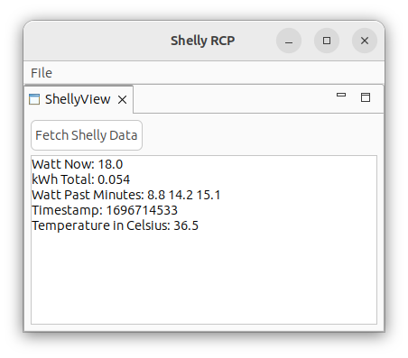

# Shelly (Plus Plug S, Gen2) - Eclipse RCP application

Shelly Plus Plug S v2 is a WI-FI smart plug with an embedded web server. The CPU is an ESP32, Flash 4MB.
The app is based on Eclipse 3.x and uses Java 1.7 :)



# Troubleshooting
Run with clear workspace for RCP app. Use `-clearPersistedState` flag.

```
Run Configuration > Program arguments > Arguments > 
```

# Shelly connecton

```bash
# the default IP on AP access point modus
export SHELLY=192.168.33.1

curl http://${SHELLY}/shelly
curl -X POST -d '{"id":1,"method":"Shelly.GetDeviceInfo"}' http://${SHELLY}/rpc
curl -X POST -d '{"id":1,"method":"Switch.GetStatus","params":{"id":0}}' http://${SHELLY}/rpc
```

# Links
* https://shelly-api-docs.shelly.cloud/gen2/ComponentsAndServices/Switch#switchgetstatus-example
* https://shelly-api-docs.shelly.cloud/gen2/General/Authentication#authentication-process
* https://shelly-api-docs.shelly.cloud/gen2/ComponentsAndServices/Shelly#http-endpoint-shelly

Shelly uses Mongoose OS RPC mechanism and there is REST API
* https://github.com/mongoose-os-apps/shelly-homekit/issues/217
* https://mongoose-os.com/docs/mongoose-os/userguide/rpc.md
